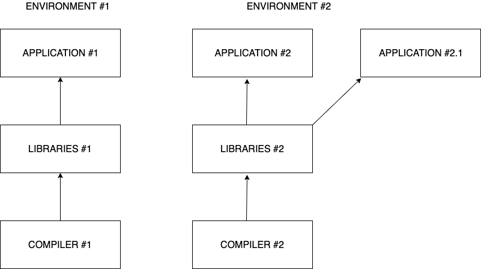

# Linux Cluster Institute: 

# Lmod, A Modern

# Environment Module System


<br><br>

Alexei Kotelnikov 

School of Engineering,  
Rutgers University
    https://ecs.rutgers.edu


## Outline of the presentation

- User environments in the Unix/Linux shell. 
- Tcl/C module examples and motivation for the Lua based Lmod modules.
- Setup Lmod for the lab exercises.
- MODULEPATH and explanation how LMOD works
- Practice with basic module commands and examples.
- Module lua file structure.
- Useful features of LMOD
- LMOD usage tracking through syslog


## Why to use environment modules


<table>
<tr>
<td>
Reason:
</td>
<td>
Environment variables affected:
</td>
</tr>
<tr>
<td>
    <b>Different Compilers:</b> gcc 8.5.0, gcc 12.0.0, Intel 2020, etc 
</td>
<td>
PATH, CPATH, LIBRARY_PATH
</td>
</tr>
<tr>
<td>
<b>Different apps:</b> shared object libs (*.so), MPI, Java, Licenses, etc
</td>
<td>
LD_LIBRARY_PATH, MPI_HOME, JAVA_HOME, LM_LICENSE_FILE
</td>
</tr>
</table>

Environment modules allow switching seamlessly between the user environments without need for modifying `/etc/profile` or `.bashrc` files.





## Classical TCL/C Environment Modules 

- To overcome the difficulty of setting and changing the Environment variables, the TCL/C Modules were introduced over 2 decades ago.
- They were written in C and used TCL language for environment configuration.
- Very robust and easy to use, for example, to load Intel 2018 compiler: 
```bash
module load intel/2018
```
- Check what the modules are loaded:
```bash
module list
```
- See what the modules are available to load: 
```bash
module avail
```
- Unload the module:
```bash
module unload intel/2018
```

## TCL/C modules drawback and motivation for migration to Lmod

- The classical TCL/C modules allow conflicting environment modules to be loaded at the same time. For example:
```bash
module switch intel/2018 intel/2013
module list
```
shows:
`intel/2013 openmpi/2.1.2-intel2018`
- Users should watch what modules are loaded before performing compilation and running their codes.
- The rule of thumb is, first, to unload all the modules with command 
```bash
module purge
```
- Then load specifically what is needed, for example:
```bash
module load intel/2018
module load openmpi/2.1.2-intel2018
```

- Better approach is switching to Lmod.
- The Lmod configuration can protect users from loading incompatible environment settings.

## Lmod (“L” stands for Lua) vs TCL/C modules

- Lmod is an environment modules implementation that provides all of the functionality of TCL/C Environment Modules plus more features.
- Lmod can read modules written in TCL and in lua.
- Support for hierarchical module file structure.
- MODULEPATH is dynamically updated when modules are loaded.
- Makes loaded modules inactive and active to provide sane environment.
- User module collections.
- Hidden modules.
- Optional usage tracking.
- Many useful functions in Lua module configuration files, such as family(“compiler”), property(“gpu”), etc

## LMOD installation steps

- Install Lua
- Install LMOD
- Setup the environment configuration in <module_name>.lua files.
- Initialize MODULEPATH and MODULEPATH_ROOT entries in <tt>.bashrc</tt>

- Details are here: [Installing Lua and Lmod](https://lmod.readthedocs.io/en/latest/030_installing.html)

## LMOD setup on your lab cluster

SSH to to the cluster.

Copy folder Ansible-lmod from git repository into the home directory:

```bash
cp -a lci-scripts/introductory/lmod/Ansible-lmod .
```

Step into directory Ansible-lmod and install Lmod:
```bash
cd Ansible-lmod 
ansible-playbook install_lmod.yml
```

In `.bashrc` file of user `mpiuser`, remove the settings for openmpi, and add the following block at the bottom:

```cpp
if [ -z "$BASHRC_READ" ]
then
  export BASHRC_READ=1
  . /usr/share/lmod/lmod/init/profile
  export MODULEPATH_ROOT=/usr/share/lmod/lmod/modulefiles
  export MODULEPATH=$MODULEPATH_ROOT/Core
  export LMOD_PACKAGE_PATH=/usr/share/lmod/lmod/libexec
fi
```


Alternatively you can overwrite his .bashrc file as follows:

```bash
cp Modules/bashrc-lmod ~mpiuser/.bashrc
```

Become mpiuser and run command module:

```bash
sudo su - mpiuser
module avail
```

## LMOD demo with loading and unloading the modules.

- Check available modules:
```bash
module available
```
- Shortcut:
```bash
ml av
```
- See all modules via spider:
```bash
module spider
```
- Shortcut:
```bash
ml spider
```
- Load module gcc/8.5.0
```bash
module load gcc/8.5.0
```
- Shortcut
```bash
ml gcc/8.5.0
```

- List loaded modules:
```bash
module list
```
- Shortcut:
```bash
ml
```
- See what modules need to be loaded for application lammps:
```bash
module spider lammps
```
If it doesn't show up because it is `hidden`
- Try the following:
```bash
module --show-hidden spider
```

- Load the prereq modules:
```bash
module load openmpi/5.0.1
```
- See what modules are available now:
```bash
ml av
```
- See the hidden modules:
```bash
ml --show-hidden av
```
- Load ```lammps```:
```bash
ml lammps
```


- Unloading the base module, gcc/8.5.0, will deactivate the others, openmpi/4.1.4 and lammps:
```bash 
module unload gcc/8.5.0
```

- The dependent modules will also get deactivated if the different compiler is loaded, for example:
```bash
module load intel/2018
```

- To unload all the modules:
```bash
module purge
```


## How the things work

- File .bashrc references the Lua modules and initialize MODULEPATH_ROOT and MODULEPATH environment variables:

```c
if [ -z "$BASHRC_READ" ]
then
  export BASHRC_READ=1
  . /usr/share/lmod/lmod/init/profile
  export MODULEPATH_ROOT=/usr/share/lmod/lmod/modulefiles
  export MODULEPATH=$MODULEPATH_ROOT/Core

fi
```


- The initial MODULEPATH=modulefiles/Core

- After command `module load gcc/8.5.0`, the MODULEPATH gets updated:      ```MODULEPATH=modulefiles/Compiler/gcc/8.5.0:modulefiles/Core```

- After adding another module, `module load openmpi/5.0.1`, the MODULEPATH contains the directory with file
 ```lammps.lua```


```yaml
modulefiles/
|-- Compiler
|   |-- gcc
|   |    \-- 8.5.0
|   |         \-- openmpi
|   |              \-- 5.0.1.lua <-- 2 updates: 
|    \-- intel      "MODULEPATH=modulefiles/MPI/gcc/8.5.0/5.0.1:$MODULEPATH"
|       |-- 2013
|       |    \-- openmpi
|       |       |-- 1.6.5.lua
|       |        \-- 1.8.8.lua
|        \-- 2018
|            -- openmpi
|               |-- 1.8.8.lua
|               |-- 2.1.1.lua
|               \-- 2.1.2.lua
|-- Core
|   |-- gcc
|   |    \-- 8.5.0.lua <--- 1 updates:  
|    \-- intel     "MODULEPATH=modulefiles/Compiler/gcc/8.5.0:modulefiles/Core"
|       |-- 2013.lua
|        \-- 2018.lua
 \-- MPI
    |-- gcc
    |    \-- 8.5.0
    |         \-- 5.0.1
    |             \-- lammps.lua  <-- 3 is in the updated MODULEPATH
     \-- intel
          \-- 2018
              \-- 2.1.2
                  \-- vasp.lua
```


## Module file example: `8.5.0.lua`

```c
-- -*- lua -*-

help([[ This is a gcc 8.5.0 compiler, came with Red Hat 8.6 packages]])

-- Local variables
local version = "8.5.0"

-- Whatis description
whatis("Description: GCC compiler") 

-- Setup Modulepath for packages built by this compiler
local mroot = os.getenv("MODULEPATH_ROOT")
local mdir = pathJoin(mroot,"Compiler/gcc", version)
prepend_path("MODULEPATH", mdir)
 
 
-- Set family for this module
family("compiler")

```

<hr>

## Helpful LMOD functionalities.

- Module tags, for example:
```c
add_property("state","testing")
add_property("arch","gpu")
```

- Hide modules when software is updated or decommissioned. Place file `.modulerc.lua` in the same directory with the module, for example, in directory `modulefiles/MPI/gcc/8.5.0/5.0.1`:
```c
hide_version("lammps") 
```

- User module collections can be saved and restored by a user, for example:
```bash
module load gcc/8.5.0
module load openmpi/5.0.1
module save gcc-openmpi
```
It saves the environment configuration into `~/.lmod.d/gcc-openmpi` Lua file.

To restore the environment:
```bash
module restore gcc-openmpi
```

One can restore the module collections through ```.bashrc```:
```c
module -q restore gcc-openmpi
```

- Lmod can track environment module usage by users.


## Lmod configuration for module usage.

- Add new path, ```/usr/share/lmod/lmod/libexec_log```, to LMOD_PACKAGE_PATH into file .bashrc for mpiuser: 
```bash 
export LMOD_PACKAGE_PATH=/usr/share/lmod/lmod/libexec:/usr/share/lmod/lmod/libexec_log
```
- Create directory ```/usr/share/lmod/lmod/libexec_log```:
```bash
sudo mkdir /usr/share/lmod/lmod/libexec_log
```
- Copy file ```SitePackage_LOGS.lua``` into ```SitePackage.lua``` in the new directory:
```bash
sudo cp /usr/share/lmod/lmod/libexec/SitePackage_LOGS.lua /usr/share/lmod/lmod/libexec_log/SitePackage.lua
```
- Login to ```mpiuser```. 
```bash
sudo su - mpiuser
```
- Make sure the updated LMOD_PACKAGE_PATH environment variable is in the user environment.
```bash
echo $LMOD_PACKAGE_PATH
```
- Start loading modules as ```mpiuser```, for example:
```bash
module load gcc/8.5 openmpi/5.0.1
```
- Check the log updates with ModuleUsageTracking tag in /var/log/messages
```bash
grep ModuleUsageTracking /var/log/messages
```

## References

[Jeff Layton’s article in admin magazine with excellent explanation on how Lmod works and nice examples](https://www.admin-magazine.com/HPC/Articles/Environment-Modules-Using-Lmod)

[The Lmod official web site](https://lmod.readthedocs.io/en/latest/index.html)

[The TCL/C classical module web site](http://modules.sourceforge.net)

[Tracking Module Usage](https://lmod.readthedocs.io/en/latest/300_tracking_module_usage.html)

## Questions and discussion:

